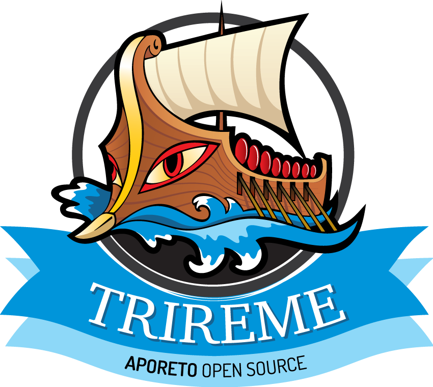

# Trireme



[](https://travis-ci.org/aporeto-inc/trireme-lib) [](https://codecov.io/gh/aporeto-inc/trireme) [](https://twitter.com/aporeto_trireme) [](https://triremehq.slack.com/messages/general/) [](https://www.gnu.org/licenses/gpl-2.0.html) [](https://godoc.org/go.aporeto.io/trireme-lib)  [](https://goreportcard.com/report/go.aporeto.io/trireme-lib)


Welcome to Trireme, an open-source library curated by Aporeto to provide cryptographic isolation for cloud-native applications.  Trireme-lib is a Zero-Trust networking 
library that makes it possible to setup security policies and segment applications by enforcing end-to-end authentication and authorization without the need 
for complex control planes or IP/port-centric ACLs and east-west firewalls.

Trireme-lib supports both containers and Linux Processes as well user based activation and it allows security policy enforcement between any of these entities.

# TL;DR

Trireme-lib is a library. The following projects use it:

* [Trireme as a set of simple examples to get started](https://github.com/aporeto-inc/trireme-example)
* [Trireme implementing NetworkPolicies on Kubernetes](https://github.com/aporeto-inc/trireme-kubernetes/tree/master/deployment)

# Description

In the Trireme world, a processing unit end-point can be a container, Kubernetes POD, or a general Linux process. It can also be a user session
to a particular server. We will be referring to processing units as PUs throughout this discussion.

The technology behind Trireme is streamlined, elegant, and simple. It is based on the concepts of Zero-Trust networking:

1. The identity is the set of attributes and metadata that describes the container as key/value pairs. Trireme provides an extensible interface for defining these identities. Users can choose customized methods appropriate to their environment for establishing PU identity. For example, in a Kubernetes environment, the identity can be the set of labels identifying a POD.
2. There is an authorization policy that defines when processing units with different types of identity attributes can interact or exchange traffic. The authorization policy implements an Attribute-Based Access Control (ABAC) mechanism (https://en.wikipedia.org/wiki/Attribute-Based_Access_Control), where the policy describes relationships between identity attributes.
3. Every communication between two processing units is controlled through a cryptographic end-to-end authentication and authorization step, by overlaying an authorization function over the TCP negotiation. The authorization steps are performed during the `SYN`/`SYNACK`/`ACK` negotiation.

The result of this approach is the decoupling of network security from the underlying network infrastructure because this approach is centered on workload identity attributes and interactions between workloads. Network security can be achieved simply by managing application identity and authorization policy. Segmentation granularity can be adjusted based on the needs of the platform.

Trireme is a node-centric library.  Each node participating in the Trireme cluster must spawn one instance of a process that uses this library to transparently insert the authentication and authorization step. Trireme provides the data path functions but does not implement either the identity management or the policy resolution function. Function implementation depends on the particular operational environment. Users have to provide PolicyLogic (ABAC “rules”) to Trireme for well-defined PUs, such as containers.

# Existing implementation using Trireme library

* [This example ](https://github.com/aporeto-inc/trireme-example) is a straightforward implementation of the PolicyLogic for a simple use-case.

* [Kubernetes-Integration ] (https://github.com/aporeto-inc/kubernetes-integration) is a full implementation of PolicyLogic that follows the Kubernetes Network Policies model.

* [Bare-Metal-Integration] (https://github.com/aporeto-inc/trireme-bare-metal) is an implementation of Trireme for Kubernetes on-Prem, with a Cumulus agent that allows you to have a very simple networking model (routes are advertised by Cumulus) together with Trireme for policy enforcement.


# Security Model

Trireme is a Zero-Trust networking library. The security model behind Zero-trust networking is:
* The Network is always untrusted. It doesn't matter if you are inside or outside your enterprise.
* Every Flow/Connection needs to be authenticated and authorized by the endpoints.
* The network information (IP/Port) is completely irrelevant to the authorization/authentication.

With Trireme, there is no need to define any security rules with IPs, port numbers, or ACLs.   Everything is based on identity attributes; your IP and port allocation scheme is not relevant to Trireme and it is compatible with most underlying networking technologies. The end-to-end authentication and authorization approach is also compatible with NATs and IPv4/IPv6 translations.


A PU is a logical unit of control to which you attach identity and authorization policies. It provides a simple mechanism where the identity is derived out of the Docker manifest; however, other mechanisms are possible for more sophisticated identity definition.   For instance, you may want to tag your 3-tier container application as "frontend," "backend," and "database." By associating corresponding labels and containers, these labels become "the identity." A policy for the “backend” containers can simply accept traffic only from “frontend” containers. Alternatively, an orchestration system might define a composite identity for each container and implement more sophisticated policies.


PolicyLogic defines the set of authorization rules as a function of the identity of attributes and loads these rules into Trireme when a container is instantiated. Authorization rules describe the set of identities with which a particular container is allowed to interact. We provide an example of this integration logic with Kubernetes  [here](https://github.com/aporeto-inc/kubernetes-integration). Furthermore, we provide an example of a simple policy where two containers can only talk to each other if they have matching labels in [this example](https://github.com/aporeto-inc/trireme-lib/tree/master/example). Each rule defines a match based on the identity attributes. PolicyLogic assumes a whitelist model where everything is dropped unless explicitly allowed by the authorization policy.


PU identities are cryptographically signed with a node specific secret and sent as part of a TCP connection setup negotiation. Trireme supports both mutual and receiver-only authorization. Moreover, it supports two authentication and signing modes: (1) A pre-shared key and (2) a PKI mechanism based on ECDSA. In the case of ECDSA, public keys are either transmitted on the wire or pre-populated through an out-of-band mechanism to improve efficiency. Trireme also supports two identity encoding mechanisms: (1) A signed JSON Web Token (JWT) and (2) a custom binary mapping mechanism.

With these mechanisms, the Trireme run-time on each node will only allow communication after an end-to-end authentication and authorization step is performed between the containers.

# Trireme Architecture


Trireme-lib is built as a set of modules (Go packages) that provide a default implementation for each component.  It is simple to swap the default implementation of each of those modules with custom-built ones for more complex and specific features.

Conceptually, Trireme acts on PU events. In the default implementation, the PU is a Docker container.  Trireme can be extended easily to other PUs such as processes, files, sockets, and so forth.
Trireme conists of two main packages: 

* The `Monitor` listens to a well-defined PU creation module.  The built-in monitor listens to Docker events and generates a standard Trireme Processing Unit runtime representation. Additional
monitors provided can listen to events on creation of Linux processes or user sessions from the Linux PAM module. The `Monitor` hands-over the Processing Unit runtime to an external
`Resolver`.
* The `Resolver` is implemented outside of Trireme and not part of the library. The `Resolver` depends on the orchestration system used for managing identity and policy. If you plan to implement your own Policy with Trireme, you will essentially need to implement a `Resolver`.
* The `Controller` receives instructions from the `Resolver` and enforces the policy by analyzing the redirected packets and enforcing the identity and policy rules.


# Defining Your Own Policy

Trireme allows you to define any type of identity attributes and policies to associate with PUs.
In order to define your own policies and identities, you need to implement a Resolver interface that will receive policy requests from Trireme whenever a policy resolution is required.

# Resolver Implementation


```go
// A Resolver must be implemented by a policy engine that receives monitor events.
type Resolver interface {

	// HandlePUEvent is called by all monitors when a PU event is generated. The implementer
	// is responsible to update all components by explicitly adding a new PU.
	HandlePUEvent(ctx context.Context, puID string, event common.Event, runtime RuntimeReader) error
}
```

Each Container event generates a call to `HandlePUEvent`

The `Resolver` can then issue explicit calls to the `Controller` in order to implement the policy decision. The controller interface
is consumed by the `Resolver` and it is described below:

```go
// TriremeController is the main API of the Trireme controller
type TriremeController interface {
	// Run initializes and runs the controller.
	Run(ctx context.Context) error

	// CleanUp cleans all the supervisors and ACLs for a clean exit
	CleanUp() error

	// Enforce asks the controller to enforce policy on a processing unit
	Enforce(ctx context.Context, puID string, policy *policy.PUPolicy, runtime *policy.PURuntime) (err error)

	// UnEnforce asks the controller to un-enforce policy on a processing unit
	UnEnforce(ctx context.Context, puID string, policy *policy.PUPolicy, runtime *policy.PURuntime) (err error)

	// UpdatePolicy updates the policy of the isolator for a container.
	UpdatePolicy(ctx context.Context, puID string, policy *policy.PUPolicy, runtime *policy.PURuntime) error

	// UpdateSecrets updates the secrets of running enforcers managed by trireme. Remote enforcers will get the secret updates with the next policy push
	UpdateSecrets(secrets secrets.Secrets) error

	// UpdateConfiguration updates the configuration of the controller. Only specific configuration
	// parameters can be updated during run time.
	UpdateConfiguration(networks []string) error
}
```

# Prerequisites

* Trireme-lib requires IPTables with access to the `Mangle` module.
* Trireme-lib requires access to the Docker event API socket (`/var/run/docker.sock` by default)
* Trireme-lib requires privileged access.
* Trireme-lib requires to run in the Host PID namespace.

[](https://github.com/igrigorik/ga-beacon)

